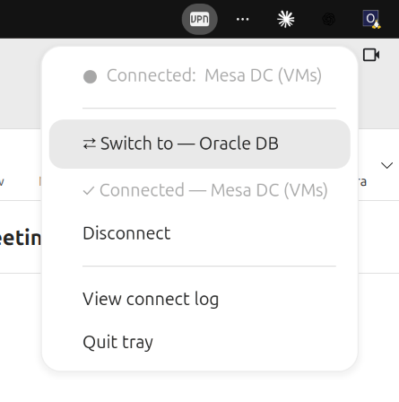

# gp-tray

A free, lightweight system-tray VPN indicator for **GlobalProtect** on Linux,
built on the open-source [`gpclient`](https://github.com/yuezk/GlobalProtect-openconnect).
It gives you the one thing the official client doesn't ship on Linux: a proper
tray applet with connect/disconnect, multi-portal switching, and desktop alerts.

 

<p align="center">
  
</p>

## Features

- **Live status** in the tray — Connected / Connecting / Disconnected, with the
  active portal shown by name.
- **Multiple portals**, switched one click at a time (GlobalProtect runs a
  single tunnel). Great when one portal is for databases and another for VMs.
- **One-click switching** — picking another portal auto-disconnects the current
  tunnel, waits for it to drop, then connects the new one.
- **Desktop notifications** on:
  - connect failure (shows the real error line from the log, e.g. a TLS/cert problem),
  - authentication cancelled/dismissed,
  - unexpected tunnel drop,
  - successful connect.
- **Accurate state detection** for modern `gpclient` (2.x), which embeds
  openconnect as a library rather than a separate process.

## Requirements

- [`gpclient`](https://github.com/yuezk/GlobalProtect-openconnect) (`gpclient`, `gpservice`)
- Python 3 with GTK 3 introspection and an AppIndicator library:
  ```bash
  # Debian / Ubuntu / Pop!_OS
  sudo apt install python3-gi gir1.2-gtk-3.0 gir1.2-ayatanaappindicator3-0.1 libnotify-bin
  # Fedora
  sudo dnf install python3-gobject gtk3 libayatana-appindicator-gtk3 libnotify
  # Arch
  sudo pacman -S python-gobject gtk3 libayatana-appindicator libnotify
  ```
- `pkexec` (polkit) — used to run `gpclient connect/disconnect` with privilege.
- **GNOME Shell users:** the top-bar tray icon needs the [AppIndicator and
  KStatusNotifierItem Support](https://extensions.gnome.org/extension/615/appindicator-support/)
  extension — vanilla GNOME Shell (Wayland or X11) hides AppIndicator icons
  without it. KDE Plasma, XFCE, Cinnamon, MATE, and other tray-capable
  desktops work out of the box.

## Install

```bash
git clone https://github.com/DavidVeksler/gp-tray.git
cd gp-tray
./install.sh
```

Then edit your portals:

```bash
$EDITOR ~/.config/gp-tray/portals.conf
```

```ini
# Friendly Name = portal.hostname
Work VPN      = portal.example.com
Secondary VPN = vpn2.example.com
```

Start it (also auto-starts on next login):

```bash
gp-tray &
```

## Configuration

Portals live in `~/.config/gp-tray/portals.conf`, one per line as
`Friendly Name = hostname`. Lines starting with `#` are ignored. You can also
set the `GP_PORTAL` environment variable to inject an extra portal at runtime.

## Troubleshooting

**`certificate verify failed` / `unable to get local issuer certificate`.**
Your portal is serving a valid cert but omitting an intermediate CA. Fetch the
intermediate named in the leaf certificate's *CA Issuers* URL, then trust it:

```bash
sudo cp intermediate.crt /usr/local/share/ca-certificates/
sudo update-ca-certificates
```

As a last resort you can add `--ignore-tls-errors` to the `gpclient` invocation
in `gp-tray`, but installing the intermediate is the correct, secure fix.

**Menu stuck on "Connecting".** Fixed in this project — older approaches keyed
off a separate `openconnect` process, which `gpclient` 2.x no longer spawns.

## License

MIT © David Veksler. Not affiliated with Palo Alto Networks or GlobalProtect.
