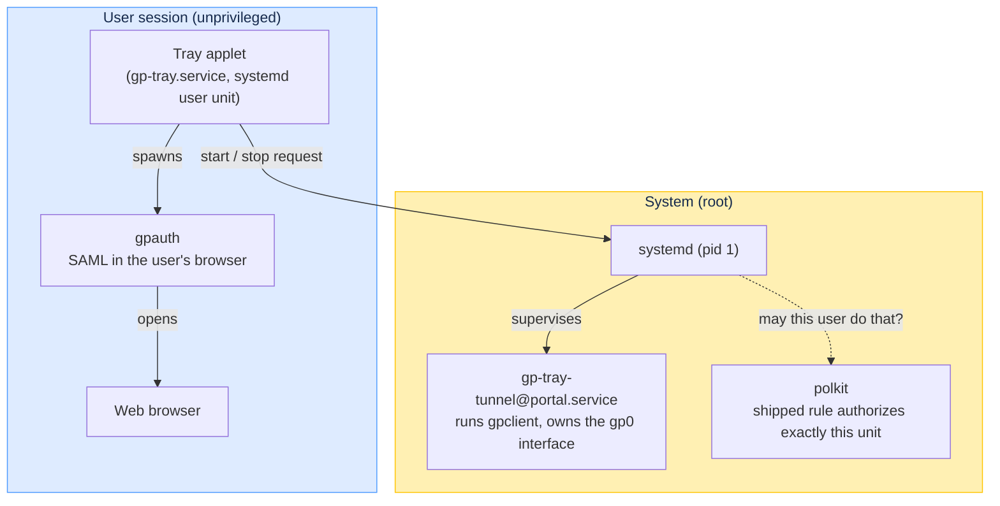
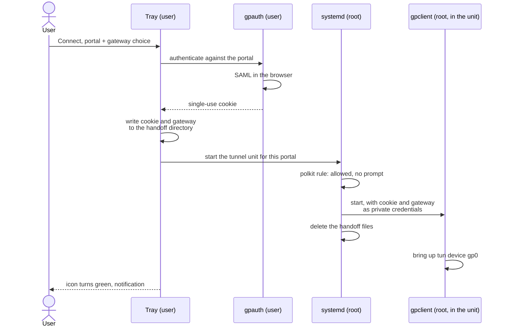

# Architecture

How gp-tray turns a tray click into a running GlobalProtect tunnel, and why
the privileged part is a systemd unit rather than a process the tray spawns
itself. Written for someone who has not read the code; the closing section
links to the source.

## Vocabulary

| Term | Meaning |
|---|---|
| Portal | The GlobalProtect entry server for a company VPN. One portal fronts one or more gateways. |
| Gateway | The server that actually terminates the VPN tunnel. A portal can offer several (per region, for example). |
| SAML | The single sign-on flow the portal uses. It happens in a web browser and ends with a short-lived authentication result, called the cookie here. |
| `gpclient` / `gpauth` | The open-source GlobalProtect client ([GlobalProtect-openconnect](https://github.com/yuezk/GlobalProtect-openconnect)). `gpauth` performs the browser SAML step; `gpclient` establishes the tunnel and needs root. |
| tun device | The virtual network interface the tunnel traffic flows through. gp-tray's tunnel always names it `gp0`. |
| polkit | The system service that decides whether an unprivileged user may perform a privileged action, based on installed rules. |
| systemd credential | A file systemd reads at service start and exposes to that service privately, so the service does not fetch secrets itself. |

## Components and privilege boundary

Everything above the line runs as the logged-in user. Only the tunnel runs as
root, and it is started through systemd, never by the tray directly.

The tray never holds privileges. It asks systemd to start or stop one
specific, statically installed service template, and a polkit rule shipped
with gp-tray answers yes for active local users. This is the same trust model
NetworkManager uses for letting desktop users bring connections up and down.

## Connecting, step by step

Details that matter:

1. The cookie is written to a handoff directory under `/run`, as a file only
   its owner can read, and it is deleted by the unit the moment the service
   has started. It exists on disk for well under a second in normal
   operation, and `/run` is memory-backed, so it never touches persistent
   storage.
2. The gateway choice travels the same way in a second file. An empty value
   means "let the server pick the fastest gateway".
3. The service command line is fixed in the installed unit file. The only
   inputs that cross the privilege boundary are the portal name (as the unit
   instance) and the two handoff files, and the root-side helper validates
   both before passing them to `gpclient`: the portal must look like a
   hostname, the gateway must not look like a command-line option. A crafted
   name cannot smuggle extra options to the privileged client.

## Disconnecting and switching

Disconnect is a stop request for any gp-tray tunnel unit. systemd delivers
the interrupt signal, which `gpclient` treats as "log out and restore
routes and DNS", with a 15 second deadline before a hard kill.

Switching portal, or switching gateway on the same portal, is a disconnect
followed by a fresh connect. A new SAML round-trip is unavoidable because
the cookie is single-use and scoped to one portal.

Suspend is treated as a disconnect too (`Conflicts=sleep.target` +
`Before=sleep.target` on the tunnel unit): a GlobalProtect session does not
survive sleep, and leaving the unit running would keep `gp0`, the default
route and the VPN DNS pointing into a dead tunnel — no internet after
resume. Stopping before sleep lets `gpclient` restore routing and DNS, so
the machine wakes up with working networking and the tray simply shows
Disconnected.

## How the tray knows the state

The tray polls two facts every 3 seconds and combines them:

| Tunnel unit | `gp0` interface | Shown state |
|---|---|---|
| active | up | Connected |
| active | absent | Connecting |
| inactive | up | Connected (tunnel started outside the tray) |
| inactive | absent | Disconnected |

While the browser SAML step is in progress the tray reports Connecting
regardless, since no unit exists yet. Checking the interface by its fixed
name is deliberate: matching "any tun device" would misreport other VPNs,
such as Tailscale, as GlobalProtect state.

Because the tunnel is a systemd service and not a child of the tray, the
tray can crash or restart without dropping the VPN; on startup it recovers
the state from the same two facts.

## Why not pkexec

Earlier versions ran the client through `pkexec`, which meant a password
prompt on every connect and disconnect, and a root process tied to the
desktop session. The current design keeps authentication in the user's
browser, confines root to a supervised service with a fixed command line,
and reduces the authorization question to "may this user start or stop this
one unit", answered once by an auditable rule instead of a prompt each time.

## What gets installed where

| Piece | Path (package install) |
|---|---|
| Tray applet | `/usr/bin/gp-tray` |
| Tray user unit | `/usr/lib/systemd/user/gp-tray.service` |
| Tunnel system unit | `/usr/lib/systemd/system/gp-tray-tunnel@.service` |
| Root-side helper | `/usr/lib/gp-tray/gp-tray-tunnel` |
| polkit rule | `/usr/share/polkit-1/rules.d/50-gp-tray.rules` |
| Handoff directory setup | `/usr/lib/tmpfiles.d/gp-tray.conf` |
| State icons | `/usr/share/icons/hicolor/scalable/status/` |

Per-user state lives in `~/.config/gp-tray/` (portals and gateways) and
`~/.cache/gp-tray/` (log, active portal, remembered gateway choices).
Tunnel logs go to the system journal: `journalctl -u 'gp-tray-tunnel@*'`.

## Where the code lives

- Tray applet: [`gp-tray.py`](../gp-tray.py)
- Tunnel unit template: [`systemd/gp-tray-tunnel@.service.in`](../systemd/gp-tray-tunnel@.service.in)
- Root-side helper: [`libexec/gp-tray-tunnel`](../libexec/gp-tray-tunnel)
- polkit rule: [`polkit/50-gp-tray.rules`](../polkit/50-gp-tray.rules)
- Handoff directory: [`tmpfiles.d/gp-tray.conf`](../tmpfiles.d/gp-tray.conf)
- Packaging and release automation: [`packaging/arch/`](../packaging/arch/), [`RELEASING.md`](../RELEASING.md)
